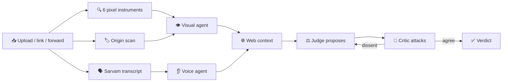

# 🔬 Lumen — check suspicious media before you share it

<p align="center">
  <a href="https://lumen-promptwars.vercel.app"></a>
  
  
  
</p>

> A journalist gets a **Malayalam voice note** claiming a miracle cure. A citizen sees an
> **AI photo of a politician** mid-scandal. Lumen scans it — pixels, provenance, voice,
> web context — argues with itself, and explains the verdict in plain language.

**🌐 Live frontend:** https://lumen-promptwars.vercel.app ·
**⚙️ Live API:** https://lumen-promptwars.onrender.com (`/health`, `/api/v1/...`)

---

## ✨ What it does

| You submit… | Lumen runs… | You get… |
|---|---|---|
| 🖼️ Photo / 📹 video | 6 pixel instruments + AI eye + origin scan | Probability dial + heatmaps |
| 🎙️ Voice note (any of 22 Indian languages) | Sarvam transcript + voice forensics | Language chip + transcript + translation |
| 🔗 YouTube / Insta / TikTok / X / FB link | Download + full pipeline | Same report, source named |
| 💬 WhatsApp forward | Identical pipeline (`source="whatsapp"`) | Verdict reply + report link |
| ❓ Follow-up | Ask-the-agent, grounded in the case | Plain-language answer |

Every verdict carries **reasons in plain words**, **source links** (PIB / Alt News / BOOM first),
and a **dissent record** — because a second analyst checked the first one's work. 👇

---

## 🧠 How a verdict is born



### 🔧 The six pixel instruments (local, instant, no GPU)

| Instrument | Catches | 
|---|---|
| **ELA** | Spliced regions glowing at different compression |
| **DCT grid** | Pasted blocks breaking the camera's rhythm |
| **Noise grain** | Foreign grain signatures |
| **Copy-move** | Cloned regions stamped twice |
| **JPEG ghost** | Double-compression mismatches |
| **Blockiness** | Grid-misaligned splices |

### 🏷️ Origin scan (is it *labeled* synthetic?)

Real byte-level fingerprints — **C2PA manifests**, PNG `parameters` chunks
(Automatic1111), EXIF generator tags (Firefly, Midjourney, DALL·E, SynthID-marked XMP).
Presence is strong evidence; absence proves nothing (stripping is trivial) — and the judge is told exactly that.

### 🥊 The debate (why two agents?)

One model judging its own homework drifts. So a **critic** steelmans then attacks every
proposal, the judge reconsiders once, and the disagreement is printed on the report.
Live example: critic caught that "clean pixels ≠ verified" on a claim-less landscape —
judge held its verdict *and said why*. Deterministic (`temperature: 0`, low thinking).

### 🗣️ Voice in your language

Hindi, Bengali, Marathi, Telugu, Tamil, Gujarati, Kannada, Malayalam, Odia, Punjabi,
Urdu, Assamese + 10 more — auto-detected, transcribed, translated. Code-mixing
(Hinglish, Tanglish) is normal speech, never a synthetic tell.

---

## 🚀 Quickstart (no Docker)

```bash
cp backend/.env.example backend/.env        # add OPENCODE_ZEN_API_KEY, SARVAM_API_KEY, EXA_API_KEY
cp frontend/.env.example frontend/.env.local
cd backend && pip install -r requirements.txt && uvicorn app.main:app --reload --port 8000
cd frontend && npm install && npm run dev
```

Open http://localhost:3000 (web) · http://localhost:8000/health (api).

---

## 🗂️ Layout

`backend/app/features/*` (one folder per domain) · `frontend/app/*` ·
`skills/*` (agent checklists) · `AGENTS.md` (agent instructions) ·
`changes.md` (changelog).

## ⚠️ Known limitations

- Submissions run inline (no queue yet): typical image ~30 s; large videos may exceed
  the 60 s free-tier cap — use short clips for now.
- Instagram/X extraction depends on datacenter blocks; failures say "upload directly
  instead", never hang silently.
- WhatsApp runs on Twilio's sandbox: each tester sends the one-time join code first.

---

*Lumen is a probabilistic documentation aid, not legal certification. 🙏 Built for the
people who forward first and verify second — all of us.*
