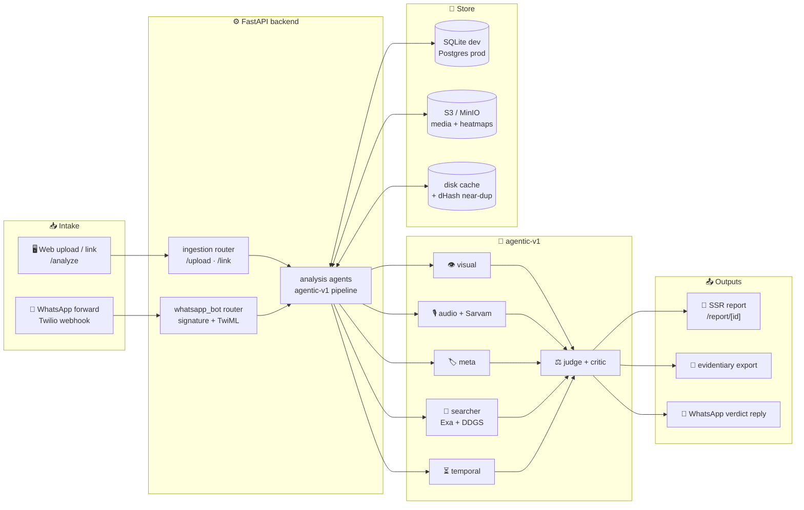

<div align="center">

# 🔍💡 Lumen

### *Forward it. Know it.* 🇮🇳

**Check any suspicious media — image, audio, video, link, or WhatsApp forward —
for signs of AI generation or manipulation.**

**Indic-languages-first • WhatsApp as a first-class intake • Indian fact-checkers first**

---

[](https://lumen-promptwars.vercel.app/)
[](https://lumen-promptwars.onrender.com/health)
[](https://nextjs.org/)
[](https://react.dev/)
[](https://fastapi.tiangolo.com/)
[](https://www.python.org/)
[](https://tailwindcss.com/)
[](#️-legal--ethical-ground-rules)

**🖥️ Frontend (live):** https://lumen-promptwars.vercel.app/ ·
**⚙️ API (live):** https://lumen-promptwars.onrender.com (`/health`, `/api/v1/...`)

</div>

---

## 📖 Table of Contents

- [🌟 Why Lumen?](#-why-lumen)
- [✨ Features](#-features)
- [🏗️ Architecture](#️-architecture)
- [🧠 How Detection Works (`agentic-v1`)](#-how-detection-works-agentic-v1)
- [🖥️ Screens & Routes](#️-screens--routes)
- [🚀 Quickstart](#-quickstart)
- [⚙️ Configuration](#️-configuration)
- [🔌 API Reference](#-api-reference)
- [📲 WhatsApp Bot Setup](#-whatsapp-bot-setup)
- [📁 Project Structure](#-project-structure)
- [🧪 Testing & Quality Gates](#-testing--quality-gates)
- [☁️ Deployment](#️-deployment)
- [⚠️ Known Limitations](#️-known-limitations)
- [🗺️ Roadmap](#️-roadmap)
- [🤝 Contributing](#-contributing)
- [⚖️ Legal & Ethical Ground Rules](#️-legal--ethical-ground-rules)

---

## 🌟 Why Lumen?

> Most deepfake fraud in India circulates as **WhatsApp forwards**, not timeline links.
> Lumen meets it where it lives. 📲

| 🧩 Problem | 💡 Lumen's answer |
|---|---|
| 😰 *"Is this voice note real?"* — a Malayalam-speaking user gets a suspicious forward | 🎙️ **Sarvam voice pipeline** across 22 Indian languages, auto-detect + translate mode, code-mixing aware |
| 🖼️ AI images that *look* right but aren't | 🔬 **4 local forensic instruments** (ELA / DCT / noise / copy-move) + vision-model reading + sha-keyed heatmaps |
| 🔗 *"Breaking news!"* clips that are actually 5 years old | ⏳ **Temporal integrity** — declared post date weighed against earliest-seen date |
| 📰 Fact-checks exist but nobody finds them | 🇮🇳 **India-first context trace** — PIB Fact Check, Alt News, BOOM, Factly hits labeled distinctly (Exa + DDGS) |
| 📤 *"I need this taken down"* | 🧾 **Takedown-ready evidentiary export** — timestamped, hash-signed dossier aligned with India's Feb 2026 IT rules |

**⚠️ Honest framing:** Lumen is a *probabilistic documentation aid, not a legal certification, not proof.*
Every report page carries that disclaimer. Every detector that can't load **fails loudly** — never a fake *"insufficient evidence"*.

---

## ✨ Features

### 🔍 Multi-modal verification
- 🖼️ **Images** — jpg / png / webp — forensic ensemble + vision forensics
- 🎙️ **Audio** — mp3 / wav / m4a / ogg — Sarvam transcription as ground truth, Indic-first (Malayalam, Hindi, Tamil, Telugu before English)
- 🎬 **Video** — mp4 / webm / mov — frame-sampled pipeline (≤6 low-detail frames), 120 s cap
- 🔗 **Links** — YouTube, Instagram, TikTok, X, Facebook, Telegram, generic — `yt-dlp` extraction + platform detection (7-way matrix)

### 📲 WhatsApp parity (not a demo extra!)
- Image / video / voice-note / link / help inbound matrix, same pipeline with `source="whatsapp"`
- ⚡ Twilio webhook validates `X-Twilio-Signature`, enqueues work, returns TwiML fast — no inline processing
- 📏 16 MB media cap → friendly *"use web upload instead"* reply (web cap 25 MB; audio 12 MB / 180 s)
- 💬 Reply = traffic-light verdict + one plain-language sentence + full report link (`format_verdict()`)

### 📊 Scan-lab + SSR verdict reports
- 🧪 `/analyze` — drag-and-drop scan-lab: probability dial + bands, staged progress
  (`Forensic instruments → Seeing/listening → Web context → Judge + critic`), elapsed timer, link submit
- 📄 `/report/[id]` — **server component** (stays SSR so shared links render proper OpenGraph preview cards):
  verdict masthead · score ledger · why-ledger reason cards · source chips · voice transcript block ·
  forensic heatmap gallery · method & limits · takedown export
- ⚡ **Instant repeats** — dHash near-dup (Hamming ≤ 8), transcript match for voice, tracker-stripped link keys → served from cache with `near-duplicate` marking

### 🧠 Agentic backbone
- 🤖 Muse Spark multi-agent pipeline (`muse-spark-1.3-contributor-free` via Zen) — deterministic (`temperature 0`), bounded debate critic
- 📚 Knowledge packs feed system prompts (`ai-image-tells`, `morph-tells`, `forward-tells`) + score-fusion table in the judge
- 🕸️ LangGraph case graph: `fetch → perceive → retrieve → adjudicate` with per-content threads
- 🛡️ Guardrails: unresolved extractions (Instagram/X datacenter blocks) **cap at `insufficient_evidence`** with the platform named — never verify; temporal override; Zen 429/5xx retries once, quota failures surface loudly; DDG flakiness degrades to Exa-only and is recorded in `warnings`

---

## 🏗️ Architecture



**🔄 Request flow (happy path):**

1. 📤 User drops a file on `/analyze`, pastes a link, or forwards to WhatsApp
2. 🛰️ Ingestion validates MIME + size caps, streams the body (never buffers full video in memory)
3. 🧠 `analyze_image / analyze_video / analyze_audio / analyze_link` runs the **identical pipeline** — only `source=` differs (`upload` vs `whatsapp`)
4. 🔬 Local forensics → 👁️ vision/audio perception → 🔎 web context → ⏳ temporal check → ⚖️ fusion judge (+ bounded critic)
5. 📄 Verdict envelope `{ job_id, case_id, verdict, confidence }` → redirect to SSR `/report/[case_id]`
6. ⚡ Repeat of the same content? dHash / transcript / canonical-link key hits cache → **instant verdict**, marked `cached` / `near-duplicate`

---

## 🧠 How Detection Works (`agentic-v1`)

Six roles, one pipeline — `backend/app/features/analysis/agents/`:

| # | 🤖 Agent | 📝 File | What it does |
|---|---|---|---|
| 1 | 👁️ **Visual forensics** | `visual.py` + `forensics.py` | 4 local instruments (ELA / DCT / noise / copy-move) score pixels + sha-keyed heatmaps in `storage/forensics/`; vision model reads content; agent weighs instruments |
| 2 | 🎙️ **Voice forensics** | `audio.py` + `sarvam.py` | Sarvam (`saaras:v3`) transcribes 22 Indian languages (auto-detect `unknown`, translate mode); non-WAV → 16 kHz mono; transcript is ground truth; prompt covers code-mixing |
| 3 | 🏷️ **Metadata reader** | `meta.py` + `detectors/provenance.py` | C2PA credentials, EXIF, watermark signatures wherever present |
| 4 | 🔎 **Web evidence** | `searcher.py` + `context_search/fact_check_lookup.py` | Exa (5 highlights) + DDG (5 per query, `in-en`); India signatories (PIB, Alt News, BOOM, Factly) labeled distinctly |
| 5 | ⏳ **Temporal integrity** | `temporal.py` + `detectors/contradiction.py` | Declared date vs earliest-seen; recycled footage flagged; can **override** the judge |
| 6 | ⚖️ **Fusion judge + critic** | `judge.py` + `critic.py` | Score-fusion table over all signals → `verdict` + `confidence` + plain-language reasons; bounded debate critic keeps it honest |

**Supporting cast:** `muse_client.py` (Zen Responses API, temp 0) · `links.py` + `link_extractor.py` (yt-dlp, 7 platforms) · `near_dup.py` (dHash ≤ 8) · `prompt_pack.py` (knowledge packs) · `synthid.py` (scanner) · `graph.py` (LangGraph wrapper — `analyze_*` are its wrappers) · `pipeline.py` (budgets, caps, cache, usage logging)

**💰 Per-call budgets:** ≤6 low-detail frames · 2000 output tokens (judge 4096 — reasoning eats headroom) · Exa 5 highlights + DDG 5 per query · `AGENT_TIMEOUT_S=20`

**🚦 Verdict vocabulary:** `verified` ✅ · `likely_authentic` 🟢 · `insufficient_evidence` ⚪ · `likely_ai_generated` 🟠 · `manipulated` 🔴 *(+ `format_failure` for unparseable WhatsApp media)*

---

## 🖥️ Screens & Routes

| Route | What you get |
|---|---|
| 🏠 `/` | Marketing hero with specimen card · 5-signal explainer · WhatsApp band |
| 🧪 `/analyze` | Dropzone (jpg/png/webp/mp3/wav/m4a/mp4/mov/webm, 25 MB) + link box + staged progress → redirects to `/report/[case_id]` |
| 📄 `/report/[id]` | SSR verdict dossier (masthead, ledgers, heatmaps, voice block, sources, export) — shareable with link previews |
| 📊 `/dashboard` | Your scan history (empty state when fresh) |
| 📲 `/whatsapp` | Sandbox join steps + live phone mock |

> 🌐 **Try it now — no install:** https://lumen-promptwars.vercel.app/ — hit **Analyze**, drop a photo, get a verdict in ~30 s.

---

## 🚀 Quickstart

### Option A — bare metal (no Docker) 🖥️

```bash
# 1️⃣ clone + env
git clone <your-fork-url> && cd promptwars
cp backend/.env.example backend/.env
cp frontend/.env.example frontend/.env.local   # fill NEXT_PUBLIC_API_URL

# 2️⃣ backend (Python MUST run inside backend/.venv — system pip is banned 🚫)
python -m venv backend/.venv
backend/.venv/Scripts/pip install -r backend/requirements.txt        # Windows
# source backend/.venv/bin/activate && pip install -r backend/requirements.txt  # macOS/Linux
backend/.venv/Scripts/uvicorn app.main:app --reload --port 8000 --app-dir backend

# 3️⃣ frontend (new terminal)
cd frontend && npm install && npm run dev
```

Open http://localhost:3000 (web) 💻 and http://localhost:8000/health (api) ⚙️.

### Option B — prod-like stack 🐳

```bash
cp backend/.env.example backend/.env
docker compose up
# → api :8000 · web :3000 · postgres · redis · minio (:9000/:9001)
```

### 🎬 60-second demo script

1. Open the live frontend 👉 https://lumen-promptwars.vercel.app/ (or local `:3000`)
2. Go to **Analyze** 🧪 → drop any photo → watch `Forensic instruments → Seeing/listening → Web context → Judge + critic`
3. Land on `/report/[id]` 📄 → probability dial, reason cards, heatmap gallery
4. Hit **Export evidentiary report** 🧾 for the takedown dossier
5. Repeat the same file ⚡ → instant cached verdict (`near-duplicate`)

---

## ⚙️ Configuration

Backend (`backend/.env` ← copy from `.env.example`):

| Key | Needed for | Notes |
|---|---|---|
| `OPENCODE_ZEN_API_KEY` / `OPENCODE_ZEN_BASE_URL` / `MUSE_MODEL` | 🤖 agentic verdicts | `muse-spark-1.3-contributor-free` via Zen |
| `EXA_API_KEY` | 🔎 web evidence | DDGS side is keyless |
| `SARVAM_API_KEY` / `SARVAM_BASE_URL` / `SARVAM_MODEL` | 🎙️ voice | `saaras:v3`, 22 langs |
| `GOOGLE_FACT_CHECK_API_KEY` | 🇮🇳 fact-check enrichment | future path, optional in v1 |
| `MONGO_URL` | 📊 usage ledger | empty = disabled (local-first, never required) |
| `TWILIO_ACCOUNT_SID` / `TWILIO_AUTH_TOKEN` / `TWILIO_WHATSAPP_NUMBER` | 📲 WhatsApp | sandbox for dev |
| `S3_ENDPOINT` / `S3_BUCKET` / `S3_ACCESS_KEY` / `S3_SECRET_KEY` | 💾 storage | unset → local `./storage` shim |
| `FRONTEND_URL` / `CORS_ORIGINS` | 🔗 CORS | must include https://lumen-promptwars.vercel.app in prod |
| `AGENT_TIMEOUT_S` | ⏱️ budgets | default `20` |

Frontend (`frontend/.env.local`):

| Key | Value (prod) |
|---|---|
| `NEXT_PUBLIC_API_URL` | `https://lumen-promptwars.onrender.com` |
| `NEXT_PUBLIC_WS_URL` | `wss://lumen-promptwars.onrender.com` |

> 🔒 Never commit `.env` secrets. `.gitignore` already excludes them.

---

## 🔌 API Reference

Base prod: `https://lumen-promptwars.onrender.com` · Local: `http://localhost:8000`

| Method & path | 📝 Description |
|---|---|
| `GET /health` | ✅ Liveness `{ status: "ok", env }` |
| `POST /api/v1/ingestion/upload` | 📤 Analyze a file — **raw body** (`Content-Type` = media MIME, not multipart), 25 MB cap → verdict envelope |
| `POST /api/v1/ingestion/link` | 🔗 Analyze a URL (`{ url }`, tracker params stripped) → verdict envelope |
| `GET /api/v1/ingestion/status` | 🛰️ Ingestion liveness |
| `GET /api/v1/analysis/report/{id}` | 📄 Full verdict dossier (hex-key validated) |
| `GET /api/v1/analysis/signals` | 📶 Signal payload for a case |
| `GET /api/v1/analysis/forensics/{name}` | 🖼️ Allowlisted heatmap streaming (`storage/forensics/`) |
| `GET /api/v1/analysis/usage` | 📊 Usage ledger (Atlas in prod) |
| `GET /api/v1/reports/{id}/export` | 🧾 Takedown-ready signed dossier (states *"documentation aid, not legal certification"*) |
| `POST /api/v1/whatsapp/webhook` | 📲 Twilio inbound (validates `X-Twilio-Signature`, fast TwiML ack) |

**Envelope shape** (upload/link/WhatsApp all return this):

```jsonc
{
  "job_id": "7a11c902…",
  "case_id": "7a11c902…",
  "verdict": "likely_ai_generated",
  "confidence": 0.86
}
```

**cURL cheat-sheet** 📋:

```bash
# health
curl https://lumen-promptwars.onrender.com/health

# image verdict (raw body — note --data-binary + explicit Content-Type)
curl -X POST https://lumen-promptwars.onrender.com/api/v1/ingestion/upload \
  -H "Content-Type: image/jpeg" --data-binary @suspect.jpg

# link verdict
curl -X POST https://lumen-promptwars.onrender.com/api/v1/ingestion/link \
  -H "Content-Type: application/json" -d '{"url":"https://www.youtube.com/watch?v=…"}'

# full report
curl https://lumen-promptwars.onrender.com/api/v1/analysis/report/7a11c902
```

---

## 📲 WhatsApp Bot Setup

1. 🔑 Create a Twilio account → enter the **WhatsApp sandbox** → note the sandbox number + join code
2. 🔧 Set `TWILIO_*` in `backend/.env`; point the sandbox webhook at `POST /api/v1/whatsapp/webhook`
3. 📩 On your phone: message the **join code** to the sandbox number (one-time, per tester — sandbox requirement)
4. ⏩ Forward any voice note / image / video / link → get back verdict + reason + report link
5. 📦 Over 16 MB? You'll get the *"use web upload instead"* reply — by design

---

## 📁 Project Structure

```text
promptwars/
├── 🖥️ frontend/                    # Next.js 15 App Router · TS strict · Tailwind v4 · shadcn/ui
│   ├── app/
│   │   ├── page.tsx                # 🏠 marketing hero + specimen card
│   │   ├── analyze/page.tsx        # 🧪 scan-lab (dropzone + progress → report redirect)
│   │   ├── report/[id]/page.tsx    # 📄 SSR verdict dossier (MUST stay a server component)
│   │   ├── dashboard/page.tsx      # 📊 history
│   │   └── whatsapp/page.tsx       # 📲 sandbox onboarding
│   ├── components/ + features/report/  # verdict-masthead, score/why ledgers, source-chips,
│   │                                   # voice-block, forensic-gallery, debate-note …
│   └── lib/                        # api-client, websocket, verdict helpers
├── ⚙️ backend/                     # Python 3.12+ · FastAPI async · SQLAlchemy 2.0 · Alembic
│   ├── app/
│   │   ├── main.py                 # app factory + CORS + /health
│   │   ├── core/config.py          # pydantic-settings
│   │   ├── db/                     # session + usage ledger (SQLite dev / Postgres prod / Mongo best-effort)
│   │   ├── api/v1/router.py        # mounts only — features own their routers
│   │   └── features/
│   │       ├── analysis/           # 🧠 agents/* (pipeline, visual, audio, judge, searcher …)
│   │       │                       #    + detectors/* (image/video/audio, provenance, contradiction)
│   │       ├── ingestion/          # 📥 upload + yt-dlp link extractor + platform detect
│   │       ├── whatsapp_bot/       # 📲 signature check + media + messages + TwiML
│   │       ├── context_search/     # 🇮🇳 fact-check lookup with India-signatory labeling
│   │       ├── reports/            # 🧾 evidentiary export (signed PDF/JSON)
│   │       ├── community/ users/   # 👥 annotations · 🔑 auth
│   │       └── worker.py           # Taskiq entry (queue lands here; inline today)
│   ├── tests/                      # pytest suite (mocks live ONLY here — never in shipped code)
│   └── requirements.txt
├── 🧰 skills/                      # codebase checklists: detector-module · fastapi-feature ·
│                                   # nextjs-report-page · whatsapp-webhook · commit-conventions …
├── 📜 AGENTS.md · planning.md · changes.md
├── 🐳 docker-compose.yml           # api + worker + web + postgres + redis + minio
├── ▲ vercel.json · render.yaml     # deploy blueprints
└── 💾 storage/                     # local-dev shim (forensics heatmaps, agentic cache, memory)
```

> 🧭 Rule: **feature-based, never flat** top-level routers/models. Second convention beside an existing one is prohibited.

---

## 🧪 Testing & Quality Gates

```bash
# backend (from repo root; venv python ONLY)
backend/.venv/Scripts/python -m pytest backend/tests -q   # Windows
# backend/.venv/bin/python -m pytest backend/tests -q      # macOS/Linux

# frontend
cd frontend && npx tsc --noEmit   # type gate
cd frontend && npm run build      # full production check (6 routes; report SSR)
```

**Conventions:** mocks exist ONLY inside `backend/tests/` — every shipped signal, score, transcript, and verdict comes from a real tool/model call, or the path raises loudly. New tests only for genuinely uncertain edges; never assert implementation details.

**Migrations:** `cd backend && .venv/Scripts/alembic upgrade head` · new: `alembic revision --autogenerate -m "..."` (applied ones are append-only — never modify).

---

## ☁️ Deployment

| Layer | Where | Notes |
|---|---|---|
| 🖥️ Frontend | **Vercel** ▲ | https://lumen-promptwars.vercel.app/ — Root Directory `frontend/` |
| ⚙️ Backend | **Render** | https://lumen-promptwars.onrender.com — blueprint in `render.yaml`; CORS allows the Vercel origin; `/usage` reads Atlas |
| 💾 Data | Postgres + S3-compatible (R2 prod / MinIO compose) · MongoDB usage ledger (best-effort) | Local disk is never source of truth |

---

## ⚠️ Known Limitations (honest, no oversell 🙏)

- 🐢 **Submissions run inline (no queue yet):** typical image ~30 s; large videos may exceed the 60 s free-tier request cap — **use short clips for now**
- 🚧 **Instagram/X extraction** depends on datacenter blocks; failures return a clear *"upload directly instead"* error, never a silent hang — and cap at `insufficient_evidence`
- 📲 **WhatsApp = Twilio sandbox:** each tester must send the one-time join code before messaging
- 🎬 Video detector is the stretch goal — audio → image → provenance → contradiction → fact-check → explain → export came first

---

## 🗺️ Roadmap

- [ ] Taskiq + Redis background jobs + WebSocket per-job progress channel ⏳
- [ ] Google Fact Check Tools API enrichment 🇮🇳
- [ ] Video detector maturity 🎬
- [ ] Auth (JWT email first, OAuth if time allows) + community annotations 🔑
- [ ] Public WhatsApp number (out of sandbox) 📲

---

## 🤝 Contributing

1. Read `AGENTS.md` + the relevant `skills/<area>/SKILL.md` first 📚
2. Multi-file work → `todo init` a phased plan, one slice per task ✅
3. Research before editing — reuse existing patterns; `lsp references` before touching exports 🔎
4. Fix source, never suppress symptoms or fabricate fallback data 🛠️
5. Verify before yielding (pytest / `tsc --noEmit` / throwaway smoke script) 🧪
6. Commit per logical checkpoint — **Conventional Commits**, small reviewable diffs, push to `main` after each step; update `changes.md` 📝

---

## ⚖️ Legal & Ethical Ground Rules

- 🔒 **Link/WhatsApp media: transient analysis only** — no re-download or redistribution through Lumen. Same retention rule for forwards.
- 🧾 **Evidentiary export states it is a documentation aid, not a legal certification.** The report page carries a probabilistic-aid disclaimer.
- 🖼️ Never commit secrets, weights (`*.pt/*.bin/*.onnx`), bulk media, or volume dirs — repo stays public, one branch (`main`), < 10 MB.

---

<div align="center">

### 💡 *Built for the Malayalam-speaking user forwarding a suspicious WhatsApp voice note.* 🇮🇳📲

**🖥️ Try Lumen live:** https://lumen-promptwars.vercel.app/ ·
**⚙️ API:** https://lumen-promptwars.onrender.com/health ·
**📲 WhatsApp:** sandbox (see setup above)

*Probabilistic aid, not proof — but honest about it.* ⚖️✨

</div>
